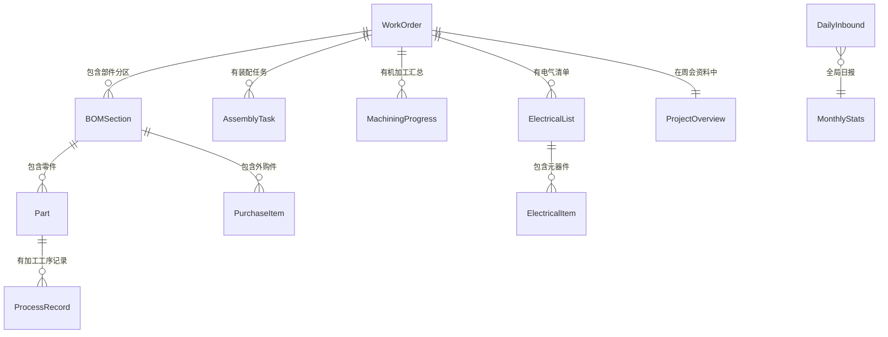

# 需求真源：Sierac 生产管理系统 v1

> **版本**: v0.3
> **业务专家**: yeemio
> **分析日期**: 2026-03-02
> **状态**: 待确认
> **v1 目标**: 现有 Excel 表格（设备生产管理表单.xlsx）的在线化
> **分析方法**: OwlSpec 表格在线化四步法

---

## 一、业务背景

Sierac 是一家包装机械制造企业，产品包括装盒机、灌装机、采集线、理瓶机等设备。每台设备从设计到发货，需要经历：出图 → 零件加工 → 外购件采购 → 装配 → 接线 → 调试 → 发货。

目前整个生产过程由一份 Excel 表格（6 个 Sheet）驱动管理，一个人统一填报。这份表格已经在实际运转中，是经过验证的业务逻辑。

**v1 目标**：把这份 Excel 搬到线上，一个人填，先跑起来。不改流程、不加权限、不做自动化。

---

## 二、现有表格结构

### Sheet 全景

| Sheet | 角色 | 行数 | 列数 | 一句话说明 |
|-------|------|------|------|-----------|
| 生产购制清单 | 核心主表 | 593 | 53 | 每个工作令的零件清单 + 外购件清单 + 各工序加工进度 |
| 装配调试进度 | 项目甘特图 | 120 | 389 | 每个工作令的装配/接线/调试任务排期和完成状态 |
| 机加工进度 | 汇总看板 | 160 | 23 | 按工作令汇总零件加工进度（图号总数、待机加、入库比例） |
| 零件加工情况汇总 | 日报 | 14 | 6 | 按日期记录每天入库零件数量 |
| 周会资料 | 项目总览 | 92 | 28 | 所有工作令的全生命周期状态（设计中→装配中→调试中→待发货→已发货） |
| 电气清单 | 电气物料表 | 193 | 11 | 每个工作令的电气元器件清单（品牌/型号/到货情况） |

### Sheet 之间的关系

**工作令号**是贯穿所有 Sheet 的核心主线。

```
周会资料（全生命周期总览，一行一个工作令）
    │
    ├── 生产购制清单（零件 + 外购件，按工作令分区，含加工工序进度）
    │
    ├── 电气清单（电气元器件，按工作令分区）
    │
    ├── 机加工进度（按工作令汇总零件加工状态）
    │
    ├── 装配调试进度（按工作令排装配/接线/调试任务）
    │
    └── 零件加工情况汇总（全局日报，不按工作令分）
```

---

## 三、数据模型

### ER 图



### 实体定义

#### WorkOrder（工作令）

贯穿全系统的核心实体。对应 Excel 中 Row 2 的合并单元格头信息。

| 字段 | 类型 | 必填 | 说明 | Excel 来源 |
|------|------|------|------|-----------|
| id | UUID | 是 | 系统主键 | — |
| work_order_no | 文本 | 是 | 工作令号 | Row2 解析，如 `TC20260106` |
| machine_model | 文本 | 是 | 机器型号 | Row2 解析，如 `V-80` |
| quantity | 整数 | 是 | 数量 | Row2 解析，如 `5` |
| created_date | 日期 | 是 | 创建日期 | Row2 解析，如 `20260107` |
| creator | 文本 | 是 | 制表人 | Row2 解析，如 `李子冉` |

#### BOMSection（BOM 分区）

零件和外购件按部件分组。对应 Excel 中的分区标题行。

| 字段 | 类型 | 必填 | 说明 | Excel 来源 |
|------|------|------|------|-----------|
| id | UUID | 是 | 系统主键 | — |
| work_order_id | FK | 是 | 所属工作令 | — |
| section_name | 文本 | 是 | 分区名称 | 如 `框架`、`转盘`、`关耳，封盒` |
| sort_order | 整数 | 是 | 排序序号 | 按 Excel 中出现顺序 |

#### Part（零件）

需要加工的零件。对应"零件清单（xxx）"分区下的数据行。

| 字段 | 类型 | 必填 | 说明 | Excel 来源 |
|------|------|------|------|-----------|
| id | UUID | 是 | 系统主键 | — |
| section_id | FK | 是 | 所属 BOM 分区 | — |
| seq_no | 整数 | 是 | 序号 | Col1 |
| drawing_no | 文本 | 否 | 图号 | Col2，如 `KJ-05` |
| part_name | 文本 | 否 | 零件名称 | Col3，如 `连接板` |
| quantity_per_unit | 整数 | 否 | 单机用量 | Col4，如 `4` |
| material | 文本 | 否 | 材料 | Col5，如 `0Cr18Ni9`、`铝型材` |
| remark | 文本 | 否 | 备注 | Col6，如 `外购芮`、`下料`、`外协二维激光` |
| completion_date | 日期 | 否 | 完成日期 | Col39 |
| status_code | 文本 | 否 | 状态码 | Col49，值为数字(1/2/3)或字母(M/N) |
| inspected_qty | 整数 | 否 | 已入/已检验 | Col50 |
| pending_purchase_date | 日期 | 否 | 待入外购件日期（零件清单中） | Col51 |
| purchase_arrival | 文本 | 否 | 外购件到货（外购件清单中） | Col52，日期或"库有" |

#### ProcessRecord（加工工序记录）

每个零件在每道工序上的进度记录。对应 Excel 中 Col7-Col38 区域。

| 字段 | 类型 | 必填 | 说明 | Excel 来源 |
|------|------|------|------|-----------|
| id | UUID | 是 | 系统主键 | — |
| part_id | FK | 是 | 所属零件 | — |
| process_name | 枚举 | 是 | 工序名称 | 见工序枚举表 |
| order_date | 日期 | 否 | 下单日期 | 工序列"下单"子列 |
| receive_date | 日期 | 否 | 收单日期 | 工序列"收单"子列 |
| work_hours | 数字 | 否 | 工时 | 工序列"工时"子列 |
| operator | 文本 | 否 | 操作人 | 从"日期+人名"格式中解析，如 `王`、`邹` |

**工序枚举**：

| 工序名 | Excel 列位置 |
|--------|-------------|
| 成品外协 | Col7-8 |
| 车加工 | Col9 区域 |
| 铣加工 | Col10 区域 |
| 钳加工 | Col11 区域 |
| 加工中心 | Col12 区域 |
| 线切割 | Col13 区域 |
| 激光 | Col14 区域 |
| 电焊 | Col15 区域 |
| 抛光 | Col16 区域 |
| 热处理 | Col17 区域 |
| 氧化 | Col18 + Col24-26 |
| 发黑 | Col19 + Col27-29 |
| 喷塑 | Col20 + Col30-32 |
| 镀铬 | Col21 + Col33-35 |
| 镀锌 | Col22 + Col36-38 |

> **注意**：Excel 中部分工序只有 1 列（只记日期），部分工序有 3 列（下单/收单/工时）。表面处理工序（氧化/发黑/喷塑/镀铬/镀锌）在 Row1 有独立的"xxx中"标题区域（Col24-38），每个占 3 列。系统统一为每个工序记录 3 个字段（下单/收单/工时），空值表示该字段不适用。

#### PurchaseItem（外购件）

需要外购的标准件/成品件。对应"外购件清单（xxx）"分区下的数据行。

| 字段 | 类型 | 必填 | 说明 | Excel 来源 |
|------|------|------|------|-----------|
| id | UUID | 是 | 系统主键 | — |
| section_id | FK | 是 | 所属 BOM 分区 | — |
| seq_no | 整数 | 是 | 序号 | Col1 |
| standard | 文本 | 否 | 标准/品牌 | Col2，如 `GB/T276-1994`、`怡合达` |
| item_name | 文本 | 是 | 名称 | Col3，如 `深沟球轴承` |
| spec_model | 文本 | 否 | 型号规格 | Col4，如 `6001` |
| quantity | 整数 | 是 | 数量 | Col5 |
| remark | 文本 | 否 | 备注 | Col6 |
| status_code | 文本 | 否 | 状态码 | Col49，值为 `N` |
| arrival_info | 文本 | 否 | 到货信息 | Col52，日期或"库有" |

#### AssemblyTask（装配任务）

每个工作令下的装配/接线/调试任务。对应 Sheet2 每行。

| 字段 | 类型 | 必填 | 说明 | Excel 来源 |
|------|------|------|------|-----------|
| id | UUID | 是 | 系统主键 | — |
| work_order_id | FK | 是 | 所属工作令 | Col2 工作令号解析 |
| project_name | 文本 | 否 | 项目名称 | Col2 项目名解析 |
| task_name | 文本 | 是 | 具体任务 | Col4，如 `小盒装盒 装配` |
| department | 文本 | 否 | 部门 | Col5 |
| assignee | 文本 | 否 | 负责人 | Col6 |
| assistant | 文本 | 否 | 资源协助 | Col7 |
| start_date | 日期 | 否 | 开始时间 | Col8 |
| end_date | 日期 | 否 | 完成时间 | Col9 |
| duration_days | 整数 | 否 | 工期（天） | Col10 |
| remark | 文本 | 否 | 备注 | Col11 |
| delay_days | 整数 | 否 | 延期天数 | Col12 |
| status | 枚举 | 否 | 完成状态 | Col13：已完成/进行中/未启动/延期/暂停 |
| progress | 小数 | 否 | 完成进度(0~1) | Col15 |

#### MachiningProgress（机加工进度）

按工作令+组件汇总的零件加工进度。对应 Sheet3 每行。

| 字段 | 类型 | 必填 | 说明 | Excel 来源 |
|------|------|------|------|-----------|
| id | UUID | 是 | 系统主键 | — |
| work_order_id | FK | 是 | 所属工作令 | Col1 工作令号解析 |
| completion_date | 日期 | 否 | 完成日期 | Col2 |
| priority | 整数 | 否 | 加工优先级 | Col3 |
| equipment_name | 文本 | 否 | 设备名称 | Col4 |
| list_date | 文本 | 否 | 清单日期 | Col4（与设备名混用） |
| component_code | 整数 | 否 | 代码 | Col5 |
| component_name | 文本 | 否 | 组件名称 | Col6 |
| total_drawings | 整数 | 否 | 图号总数 | Col7 |
| surface_treatment_count | 整数 | 否 | 表处中图号数 | Col8 |
| pending_machining_count | 整数 | 否 | 待机加图号数 | Col9 |
| pending_purchase_m | 整数 | 否 | 零件清单中待入外购件(M) | Col10 |
| pending_purchase_n | 整数 | 否 | 外购件清单中待入外购件(N) | Col11 |
| warehouse_ratio | 小数 | 否 | 入库比例/尚需加工 | Col12 |

#### DailyInbound（每日入库记录）

每天入库的零件数量。对应 Sheet4 每行。

| 字段 | 类型 | 必填 | 说明 | Excel 来源 |
|------|------|------|------|-----------|
| id | UUID | 是 | 系统主键 | — |
| date | 日期 | 是 | 日期 | Col1/3/5 |
| inbound_count | 整数 | 是 | 入库数量 | Col2/4/6 |

#### ProjectOverview（项目总览 / 周会资料）

每个工作令的全生命周期状态。对应 Sheet5 每行。

| 字段 | 类型 | 必填 | 说明 | Excel 来源 |
|------|------|------|------|-----------|
| id | UUID | 是 | 系统主键 | — |
| work_order_id | FK | 是 | 所属工作令 | Col3 |
| current_status | 枚举 | 是 | 当前状态 | Col1：已发货/待发货/调试中/装配中/设计中 |
| seq_no | 整数 | 否 | 序号 | Col2 |
| project_name | 文本 | 否 | 项目名称 | Col4 |
| salesperson | 文本 | 否 | 销售员 | Col5 |
| packaging_arrival | 日期 | 否 | 包材到货时间 | Col6 |
| designer | 文本 | 否 | 设计师 | Col7 |
| planned_delivery | 日期 | 否 | 计划交货日期 | Col8 |
| drawing_complete | 日期 | 否 | 下图完成日期 | Col9 |
| electrical_list_date | 日期 | 否 | 电气元件清单 | Col10 |
| machining_complete | 日期 | 否 | 机加工完成日期 | Col11 |
| purchase_complete | 日期 | 否 | 外购件入库日期 | Col12 |
| assembly_complete | 日期 | 否 | 装配完成日期 | Col13 |
| wiring_complete | 日期 | 否 | 接电接气完成日期 | Col14 |
| debug_complete | 日期 | 否 | 调试完成 | Col15 |
| current_situation | 文本 | 否 | 当前情况/存在问题 | Col16 |
| design_score | 数字 | 否 | 设计 | Col17 |
| machining_score | 数字 | 否 | 机加工 | Col18 |
| assembly_score | 数字 | 否 | 装配/电气 | Col19 |
| amount | 数字 | 否 | 金额（万） | Col20 |
| drawing_estimate | 整数 | 否 | 图纸数量预估 | Col22 |

#### ElectricalList（电气清单）

每个工作令的电气清单头。对应 Sheet6 每个分区的前 3 行。

| 字段 | 类型 | 必填 | 说明 | Excel 来源 |
|------|------|------|------|-----------|
| id | UUID | 是 | 系统主键 | — |
| work_order_id | FK | 是 | 所属工作令 | Row3 解析 |
| sub_type | 文本 | 否 | 子类型 | Row2 解析，如 `贴标柜内`、`贴标柜外` |
| machine_model | 文本 | 否 | 机器型号 | Row2 解析 |
| creator | 文本 | 否 | 制表人 | Row2 解析 |
| created_date | 文本 | 否 | 日期 | Row2 解析 |
| quantity | 整数 | 否 | 数量（套数） | Row3 解析 |

#### ElectricalItem（电气元器件）

具体的电气元器件。对应 Sheet6 数据行。

| 字段 | 类型 | 必填 | 说明 | Excel 来源 |
|------|------|------|------|-----------|
| id | UUID | 是 | 系统主键 | — |
| electrical_list_id | FK | 是 | 所属电气清单 | — |
| seq_no | 整数 | 是 | 序号 | Col1 |
| brand | 文本 | 否 | 品牌 | Col2，如 `汇川`、`施耐德` |
| item_name | 文本 | 是 | 名称 | Col3，如 `PLC`、`开关电源` |
| spec_model | 文本 | 否 | 型号规格 | Col4 |
| quantity | 整数 | 否 | 数量（单台） | Col5 |
| sets | 整数 | 否 | 套数 | Col6 |
| total_quantity | 整数 | 否 | 总数 | Col7 |
| order_date | 日期 | 否 | 订货日期 | Col8 |
| planned_arrival | 日期 | 否 | 计划到货日期 | Col9 |
| actual_arrival | 文本 | 否 | 实际到货 | Col10，日期或"库有" |
| remark | 文本 | 否 | 备注 | Col11 |

---

## 四、隐含规则

### 生产购制清单

| # | 表格中的表现 | 系统中的表达 | 置信度 |
|---|------------|------------|--------|
| R1 | Row2 合并单元格：`机器型号：V-80  工作令：TC20260106 数量：5 20260107李子冉` | 拆成 5 个独立字段 | 高 |
| R2 | 备注列"外购芮" = 外购件 + 负责人芮某 | v1 保持原始文本，v2 考虑拆字段 | 中 |
| R3 | Col49 混用数字(1/2/3)和字母(M/N) | v1 保持原始文本字段 | — |
| R4 | Col52 混用日期和"库有" | v1 保持原始文本字段，显示时区分 | 高 |
| R5 | 工序列"2026/2/8王" = 日期 + 操作人姓 | v1 保持原始文本，v2 拆成日期+人名 | 高 |
| R6 | 分区标题行混在数据行中间 | 系统用 BOMSection 实体表达 | 高 |
| R7 | Row2 的汇总数字（零件数320、已检验129、待做189...） | v1 手动填，v1.1 系统自动计算 | 高 |
| R8 | 外购件"标准"列混用国标号和品牌名 | v1 保持一个自由文本字段 | 高 |

### 装配调试进度

| # | 表格中的表现 | 系统中的表达 | 置信度 |
|---|------------|------------|--------|
| R9 | Col2 项目名合并单元格跨多行 | 工作令和任务是父子关系 | 高 |
| R10 | Col13 混用"已完成"和数字"1" | 统一为枚举值 | 高 |
| R11 | 甘特图区域（Col16+）每列一天 | v1 不做甘特图，只做任务列表 | — |

### 机加工进度

| # | 表格中的表现 | 系统中的表达 | 置信度 |
|---|------------|------------|--------|
| R12 | Col1 工作令号+项目名写在一个格子里（换行分隔） | 拆成两个字段 | 高 |
| R13 | Col4 混用清单日期和设备名称 | v1 保持原始文本 | 低 |
| R14 | 同一工作令占多行，工作令号只在首行出现 | 工作令和组件是父子关系 | 高 |

### 周会资料

| # | 表格中的表现 | 系统中的表达 | 置信度 |
|---|------------|------------|--------|
| R15 | Col1 状态只在分区首行出现 | 状态是每个工作令的属性 | 高 |
| R16 | 同一工作令占多行（子项目/子机器） | 工作令和子项目是父子关系 | 高 |
| R17 | 日期列混用日期格式和 Excel 序列号(46287) | 系统统一用日期类型 | 高 |

### 电气清单

| # | 表格中的表现 | 系统中的表达 | 置信度 |
|---|------------|------------|--------|
| R18 | 每个分区头 3 行是自由文本格式的头信息 | 拆成结构化字段 | 高 |
| R19 | Col10 混用日期和"库有" | v1 保持原始文本字段 | 高 |
| R20 | 同一工作令有多个分区（柜内/柜外） | 用 sub_type 字段区分 | 高 |

---

## 五、v1 系统设计

### 页面列表

| 页面 | 对应 Sheet | 核心操作 |
|------|-----------|---------|
| 工作令管理 | 贯穿所有 Sheet | 创建/查看/编辑工作令基本信息 |
| 生产购制清单 | Sheet1 | 按工作令查看/编辑零件和外购件，按分区组织，记录工序进度 |
| 装配调试进度 | Sheet2 | 按工作令查看/编辑装配任务，更新完成状态 |
| 机加工进度 | Sheet3 | 按工作令查看/编辑组件加工进度汇总 |
| 零件加工日报 | Sheet4 | 按日期记录入库数量 |
| 周会资料 | Sheet5 | 所有工作令全生命周期总览，按状态分组显示 |
| 电气清单 | Sheet6 | 按工作令查看/编辑电气元器件，跟踪到货状态 |

### v1 做什么

- 7 个页面，忠实对应 6 个 Sheet + 1 个工作令管理
- 所有字段与 Excel 一一对应，不加不减
- 一个人填报，不区分角色
- 在线录入、在线查看、在线编辑
- 按工作令号关联所有数据

### v1 不做什么

- 不做用户权限管理
- 不做审批流程
- 不做甘特图可视化
- 不做自动计算汇总
- 不做预警通知
- 不做与 ERP/其他系统的集成
- 不做 Excel 历史数据导入
- 不做移动端适配

---

## 六、待确认项

| # | 问题 | 影响 |
|---|------|------|
| Q1 | 生产购制清单的分区名称（框架、转盘、关耳封盒...）是每个工作令都一样，还是根据机器型号不同而不同？ | 分区名是枚举还是自由文本 |
| Q2 | Col49 的值含义：数字(1/2/3) = 待做数量？M = 零件清单中外购件？N = 外购件清单中外购件？ | 字段类型和业务逻辑 |
| Q3 | 工序列里的"日期+人名"（如 `2026/2/8王`）是"下单日期+操作人姓"的意思吗？ | 字段拆分方式 |
| Q4 | 工序列的"下单/收单/工时"三列结构——每个工序都有这三列吗？还是有些工序只有一列？ | 工序数据结构 |
| Q5 | Row2 的汇总数字（Col9=39, Col10=24...）是该工序的零件总数吗？ | 是否需要系统自动计算 |
| Q6 | Col50/Col51/Col52 三列的区别：Col50 是数字，Col51 是日期，Col52 是日期或"库有"——它们分别代表什么？ | 外购件跟踪逻辑 |
| Q7 | 装配调试进度的甘特图区域（Col16+）——v1 需要在线化吗？还是只做任务列表？ | v1 范围 |
| Q8 | 周会资料 Col17/18/19（设计/机加工/装配电气）是评分还是日期？ | 字段类型 |
| Q9 | 周会资料右上角统计区域（已下30/共需发14/已发11/库存19...）是什么的统计？ | 是否纳入 v1 |
| Q10 | 电气清单里同一工作令有多个分区（柜内/柜外）——分区依据是什么？ | 电气清单数据结构 |
| Q11 | 一个 Excel 文件只对应一个工作令吗？还是一个文件里会有多个工作令？ | 系统核心数据组织方式 |

---

## 七、演进路径

| 版本 | 加什么 | 前提条件 |
|------|--------|---------|
| **v1** | Excel 在线化：7 个页面，一个人填，先跑起来 | — |
| v1.1 | 自动汇总计算（零件数、入库比例、待做零件数等） | v1 跑稳 |
| v1.2 | 甘特图可视化 | v1 装配任务数据积累 |
| v1.3 | Excel 历史数据导入 | v1 数据结构确认稳定 |
| **v2** | 权限管理（生产管理、机加工、装配、电气等角色） | v1 多人使用需求明确 |
| v2.1 | 流程联动（报工触发进度更新、到货触发库存更新） | v2 权限到位 |
| **v3** | 预警通知（延期提醒、缺件提醒、交货倒计时） | v2 流程跑通 |
| v3.1 | 与 ERP 集成 | 有明确集成需求 |

---

## 变更记录

| 版本 | 日期 | 变更内容 | 变更人 |
|------|------|---------|--------|
| v0.1 | 2026-03-02 | 初稿（基于调研文档+表格，范围过大） | OwlSpec AI |
| v0.2 | 2026-03-02 | 重写：聚焦表格在线化，去掉调研文档内容 | OwlSpec AI + yeemio |
| v0.3 | 2026-03-02 | 用四步法重新分析，完整拆实体+显规则+定边界 | OwlSpec AI + yeemio |
